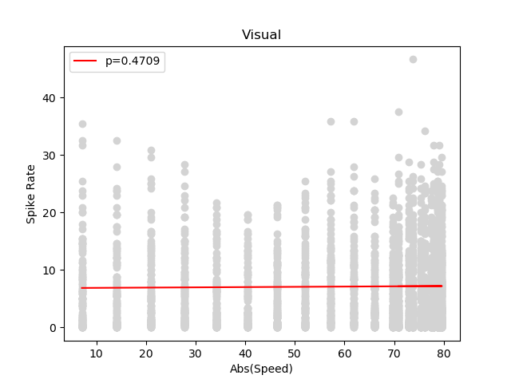

# Analysis of V1 electrophysiological recordings

## Experiment

## Data inspection

```python
import pandas as pd

dataFilename = "../../data/All_three_exp_conditions_4.csv"
data = pd.read_csv(dataFilename, index_col=0)

print(data.head)
# Index    Expt_#  Cell_# Speed     ...  Region    Layer Cell_Type
# 0           1       1  -7.072485  ...     SUB      NaN      Wide
# 1           1       1 -14.089136  ...     SUB      NaN      Wide
# 2           1       1 -20.994557  ...     SUB      NaN      Wide
# 3           1       1 -27.734234  ...     SUB      NaN      Wide
# 4           1       1 -34.254958  ...     SUB      NaN      Wide
# ...       ...     ...        ...  ...     ...      ...       ...
# 71755      17      13  79.123708  ...    RSPg  Layer 6      Wide
# 71756      17      13  77.979147  ...    RSPg  Layer 6      Wide
# 71757      17      13  76.218968  ...    RSPg  Layer 6      Wide
# 71758      17      13  73.857066  ...    RSPg  Layer 6      Wide
# 71759      17      13  70.912087  ...    RSPg  Layer 6      Wide


print(data.columns.values)
# 'Expt #' 'Cell #' 'Speed' 'Spike Rate' 'Trial Condition' 'Region' 'Layer' 'Cell Type'

trialConditions = data.loc[:, "Trial Condition"].unique()
print(trialConditions)
# ['Vestibular' 'VisVes' 'Visual']

regions = data.loc[:, "Region"].unique()
print(regions)
# ['SUB' nan 'V1' 'SC' 'RSPg' 'RSPd']
```

## Plotting relation between motion speed and firing rate for one condition

```python

import pdb
import sys
import pandas as pd
import statsmodels.api as sm
import matplotlib.pyplot as plt

def main(argv):
    if len(argv)!=2 or argv[1] not in ("Visual", "Vestibular", "VisVes"):
        raise ValueError("Invalid invokation. It should be: {:s} <Visual|Vestibular|VisVes>".format(argv[0]))

    condition = argv[1]
    dataFilename = "../../data/All_three_exp_conditions_4.csv"
    figFilename = "../../figures/spikeRateVsabsSpeedV1{:s}.png".format(condition)
    data = pd.read_csv(dataFilename, index_col=0)

    # Extract the subset of the data corresponding to vestibular-only stimulation
    # and recordings from V1
    dataSubset = data.loc[(data["Trial Condition"]==condition) &
                          (data["Region"]=="V1"),:]
    x = abs(dataSubset["Speed"])
    y = dataSubset["Spike Rate"],

    # Plot the spikes rate as a function of the absolute value of the
    # stimulation speed
    plt.scatter(x=x, y=y, c="lightgray")
    plt.title(condition)

    # Estimate the regression line
    regressors = sm.add_constant(x)
    # fit.params contains the regression coefficients
    # fit.pvalues contains the regression coefficients pvalues
    fit = sm.OLS(endog=y, exog=regressors).fit()

    # Plot the regression line
    legend = "p={:.4f}".format(fit.pvalues[1])
    predicted = fit.params[0]+x*fit.params[1] # line equation
    plt.plot(x, predicted, color="red", label=legend)
    plt.legend(loc="upper left")
    plt.xlabel("Abs(Speed)")
    plt.ylabel("Spike Rate")

    plt.savefig(figFilename)

    plt.show()

    pdb.set_trace()

if __name__=="__main__":
    main(sys.argv)
```

<!--- (--->


## Plotting relation between motion speed and firing rate for the three conditions

