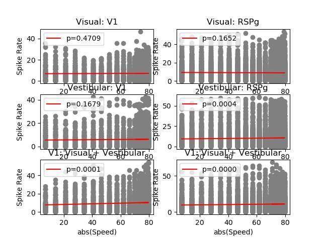
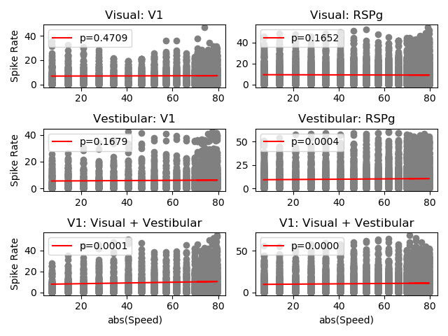

# Neural data analysis

## Experiment

We will characterize electrophysiological recordings from mice in the experiment depicted in the figure below probing the integration of visual and vestibular information across the brain ([Keshavarzi, Tyson, Lenzi et al., 2021](https://www.biorxiv.org/content/10.1101/2021.01.22.427789v4.abstract)).

[](http://www.gatsby.ucl.ac.uk/~rapela/sepi/videos/sepi.mov)

## Setup

1. sign-in to GitHub

2. go to https://github.com/joacorapela/pystarters2021

3. click on the `fork` button on the top left

4. open a terminal

5. `cd <pystarters dir>`

6. `rm -rf pystarters2021`

7. `git clone https://github.com/<your_GitHub_username>/pystarters2021.git`

## Data inspection

- In terminal one:

```
$ cd <pystarters dir>/pystarters2021/code/scripts
$ nano doInspectData.py
```

- In terminal two:

```
$ cd <pystarters dir>/pystarters2021/code/scripts
$ conda activate pystarters
$ python doInspectData.py
```

## First plot

- In terminal one:

```
$ nano doFirstPlot.py
```

- In terminal two:

```
$ python doFirstPlot.py Visual
$ python doFirstPlot.py Vestibular
$ python doFirstPlot.py VisVes
```

## Three panels in one plot (code from hell)

- In terminal one:

```
$ nano doPlotsCodeFromHell.py
```

- In terminal two:

```
$ python doPlotsCodeFromHell.py
```

## Improve the code from hell

```
$ cp doPlotsCodeFromHell.py doPlotsCodeFromHellImproved.py
```

### Exercise 1

1. create a function `plot_panel` if the script `doPlotsCodeFromHellImproved.py` and modify the script to invoke it
2. add `doPlotsCodeFromHellImproved.py` to version control

### Modules

Modules are Python files that group functions with related functionality

### Exercise 2

1. create a `plotting.py` file in the directory `../src`

   move `plotting_panel` from `doPlotsCodeFromHellImproved.py` to the `plotting` module

   import `plotting` in `doPlotsCodeFromHellImproved.py`

2. add `../src/plotting.py` to git
3. update `doPlotsCodeFromHellImproved.py` in git

### Exercise 3

1. generate a plot with three rows and two columns. In the left column show Region=V1 and in the right column show Region=RSPg. For this you could to add a parameter `region` to `plot_panel`.



2. update `../src/plotting.py` and `doPlotsCodeFromHellImproved.py` in git

3. change `plot_panel` to improve the plot (e.g., avoid overlap of labels)



4. push to GitHub

5. Use `git diff` to find out what changes in `doPlotsCodeFromHellImproved.py` and in `plotting.py` allowed to improve the plot in item 3 with respect to that in item 1.

