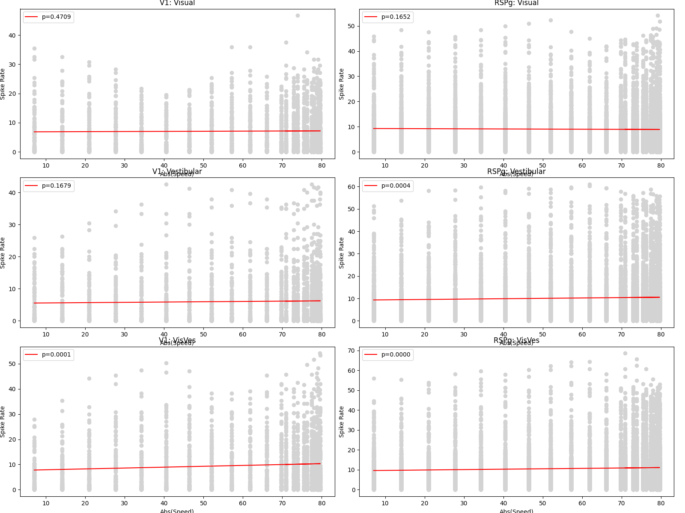

# Neural data analysis

## Experiment

We will characterize electrophysiological recordings from mice in the experiment depicted in the figure below probing the integration of visual and vestibular information across the brain ([Keshavarzi, Tyson, Lenzi et al., 2021](https://www.biorxiv.org/content/10.1101/2021.01.22.427789v4.abstract)).

[](http://www.gatsby.ucl.ac.uk/~rapela/sepi/videos/sepi.mov)

## Setup

1. sign-in to GitHub

2. go to https://github.com/joacorapela/pystarters2021

3. click on the `fork` button on the top left

4. open a terminal

5. `cd <pystarters dir>`

6. `rm -rf pystarters2021`

7. `git clone https://github.com/<your_GitHub_username>/pystarters2021.git`

## Data inspection

- In terminal one:

```
$ cd <pystarters dir>/pystarters2021/code/scripts
$ nano doInspectData.py
```

- In terminal two:

```
$ cd <pystarters dir>/pystarters2021/code/scripts
$ conda activate pystarters
$ python doInspectData.py
```

## First plot

- In terminal one:

```
$ nano doFirstPlot.py
```

- In terminal two:

```
$ python doFirstPlot.py Visual
$ python doFirstPlot.py Vestibular
$ python doFirstPlot.py VisVes
```

## Three panels in one plot (code from hell)

- In terminal one:

```
$ nano doPlotsCodeFromHell.py
```

- In terminal two:

```
$ python doPlotsCodeFromHell.py
```

## Improve the code from hell

```
cp doPlotsCodeFromHell.py doPlotsCodeFromHellImproved.py
```

### Exercise

1. create function `plot_panel` and modify the code to invoke it
2. `git status`
3. add `doPlotsCodeFromHellImproved.py` to git

### Modules

Modules are Python files that group functions with related functionality

### Exercise

1. create a plotting.py module in the directory `../src`
2. moving `plotting_panel` from `doPlotsCodeFromHellImproved.py` to the new plotting.py module
3. import `plotting` in `doPlotsCodeFromHellImproved.py`
4. add `../src/plotting.py` and `doPlotsCodeFromHellImproved.py` to git

### Exercise

1. generate a plot with three rows and two columns. In the left column show Region=V1 and in the right column show Region=RSPg. For this you could to add a parameter region to plot_panel.

2. add `../src/plotting.py` and `doPlotsCodeFromHellImproved.py` to git
3. push to GitHub

### More git

1. `git diff`: compare the version of `doPlotsCodeFromHellImproved.py` in the working directory with that in the previous commit.

2. `git checkout`: go back to the previous version.

3. I will now push solutions to my repository.

4. In your forked repository press on `Fetch upstream`

5. In your terminal type `git pull` to get ths solutions.

