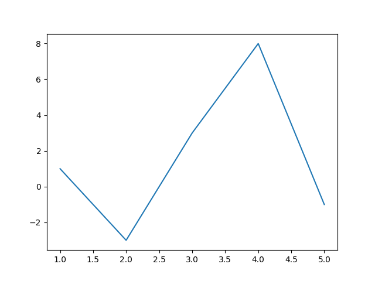
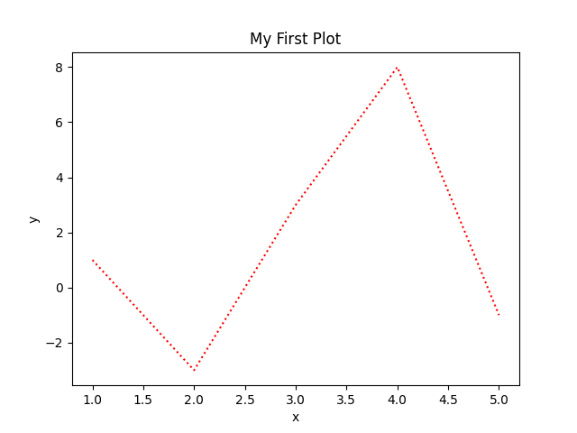
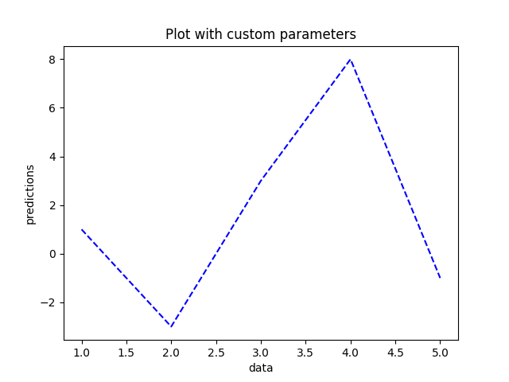
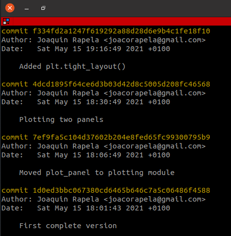
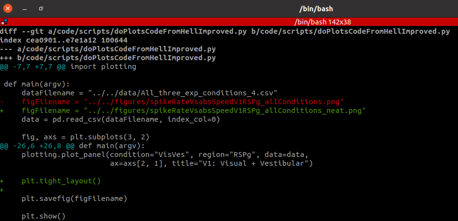

# 1_unixShell.md

## Excercise 2

File `myFirstScript.py`

```python
import numpy as np
import matplotlib.pyplot as plt

x = np.genfromtxt("../../data/x.csv")
y = np.genfromtxt("../../data/y.csv")

plt.plot(x, y)
plt.show()
```



# 3_functions.md

## Excercise 1

File `myFirstScript.py`

```python
import numpy as np
import matplotlib.pyplot as plt

def plot_1D_data(x, y, xlabel="x", ylabel="y", title="My First Plot",
                 line_color="red", line_style="dotted"):
    plt.plot(x, y, color=line_color, linestyle=line_style)
    plt.xlabel(xlabel)
    plt.ylabel(ylabel)
    plt.title(title)

x = np.genfromtxt("../../data/x.csv")
y = np.genfromtxt("../../data/y.csv")

# default parameters
plot_1D_data(x, y)
plt.show()

# custom parameters
plot_1D_data(x, y, xlabel="data", ylabel="predictions",
             title="Plot with custom parameters", line_color="blue",
             line_style="dashed")
plt.show()
```
Default parameters:



Custom parameters:



# 4_neural_data_analysis.md

## Excercise 1

1. File `code/scripts/doPlotsCodeFromHellImproved.py`

```python

import sys
import pandas as pd
import statsmodels.api as sm
import matplotlib.pyplot as plt

def plot_panel(condition, data, ax, xlabel="abs(Speed)", ylabel="Spike Rate", 
               title=None, data_color="gray", regression_line_color="red",
               line_style="solid", legend_loc="upper left",
               legend_label_pattern="p={:.04f}"):
    # Extract the subset of the data corresponding to the condition
    # and recordings from V1
    dataSubset = data.loc[(data["Trial Condition"]==condition) &
                          (data["Region"]=="V1"),:]
    x = abs(dataSubset["Speed"])
    y = dataSubset["Spike Rate"]

    # Plot the spikes rate as a function of the absolute value of the
    # stimulation speed
    ax.scatter(x=x, y=y, color=data_color, linestyle=line_style)

    # Estimate the regression line
    regressors = sm.add_constant(x)
    # fit.params contains the regression coefficients
    # fit.pvalues contains the regression coefficients pvalues
    fit = sm.OLS(endog=y, exog=regressors).fit()

    # Plot the regression line
    legend_label = legend_label_pattern.format(fit.pvalues[1])
    predicted = fit.params[0]+x*fit.params[1] # line equation
    ax.plot(x, predicted, color=regression_line_color, label=legend_label)
    ax.legend(loc=legend_loc)
    ax.set_xlabel(xlabel)
    ax.set_ylabel(ylabel)
    if title is None:
        title = condition
    ax.set_title(title)

def main(argv):
    dataFilename = "../../data/All_three_exp_conditions_4.csv"
    figFilename = "../../figures/spikeRateVsabsSpeedV1_allConditions.png"
    data = pd.read_csv(dataFilename, index_col=0)

    fig, axs = plt.subplots(3, 1)

    plot_panel(condition="Visual", data=data, ax=axs[0])
    plot_panel(condition="Vestibular", data=data, ax=axs[1])
    plot_panel(condition="VisVes", data=data, ax=axs[2],
               title="Visual + Vestibular")

    plt.savefig(figFilename)

    plt.show()

if __name__=="__main__":
    main(sys.argv)
```

2. `git add doPlotsCodeFromHellImproved.py`

   `git commit -m "Added"`

## Excercise 2

1. File `code/src/plotting.py`

```python

import statsmodels.api as sm

def plot_panel(condition, data, ax, xlabel="abs(Speed)", ylabel="Spike Rate", 
               title=None, data_color="gray", regression_line_color="red",
               line_style="solid", legend_loc="upper left",
               legend_label_pattern="p={:.04f}"):
    # Extract the subset of the data corresponding to the condition
    # and recordings from V1
    dataSubset = data.loc[(data["Trial Condition"]==condition) &
                          (data["Region"]=="V1"),:]
    x = abs(dataSubset["Speed"])
    y = dataSubset["Spike Rate"]

    # Plot the spikes rate as a function of the absolute value of the
    # stimulation speed
    ax.scatter(x=x, y=y, color=data_color, linestyle=line_style)

    # Estimate the regression line
    regressors = sm.add_constant(x)
    # fit.params contains the regression coefficients
    # fit.pvalues contains the regression coefficients pvalues
    fit = sm.OLS(endog=y, exog=regressors).fit()

    # Plot the regression line
    legend_label = legend_label_pattern.format(fit.pvalues[1])
    predicted = fit.params[0]+x*fit.params[1] # line equation
    ax.plot(x, predicted, color=regression_line_color, label=legend_label)
    ax.legend(loc=legend_loc)
    ax.set_xlabel(xlabel)
    ax.set_ylabel(ylabel)
    if title is None:
        title = condition
    ax.set_title(title)

```

File `code/scripts/doPlotsCodeFromHellImproved.py`

```python

import sys
import pandas as pd
import matplotlib.pyplot as plt
sys.path.append("../src")
import plotting

def main(argv):
    dataFilename = "../../data/All_three_exp_conditions_4.csv"
    figFilename = "../../figures/spikeRateVsabsSpeedV1_allConditions.png"
    data = pd.read_csv(dataFilename, index_col=0)

    fig, axs = plt.subplots(3, 1)

    plotting.plot_panel(condition="Visual", data=data, ax=axs[0])
    plotting.plot_panel(condition="Vestibular", data=data, ax=axs[1])
    plotting.plot_panel(condition="VisVes", data=data, ax=axs[2],
                        title="Visual + Vestibular")

    plt.savefig(figFilename)

    plt.show()

if __name__=="__main__":
    main(sys.argv)
```

2. `git add ../src/plotting.py`

   `git commit -m "Added"`

3. `git add doPlotsCodeFromHellImproved.py`

   `git commit -m "Moved plot_panel to plotting module"`

## Excercise 3

1. File `code/src/plotting.py`

```python

import statsmodels.api as sm

def plot_panel(condition, region, data, ax,
               xlabel="abs(Speed)", ylabel="Spike Rate",
               title=None, data_color="gray", regression_line_color="red",
               line_style="solid", legend_loc="upper left",
               legend_label_pattern="p={:.04f}"):
    # Extract the subset of the data corresponding to the condition
    # and recordings from V1
    dataSubset = data.loc[(data["Trial Condition"]==condition) &
                          (data["Region"]==region),:]
    x = abs(dataSubset["Speed"])
    y = dataSubset["Spike Rate"]

    # Plot the spikes rate as a function of the absolute value of the
    # stimulation speed
    ax.scatter(x=x, y=y, color=data_color, linestyle=line_style)

    # Estimate the regression line
    regressors = sm.add_constant(x)
    # fit.params contains the regression coefficients
    # fit.pvalues contains the regression coefficients pvalues
    fit = sm.OLS(endog=y, exog=regressors).fit()

    # Plot the regression line
    legend_label = legend_label_pattern.format(fit.pvalues[1])
    predicted = fit.params[0]+x*fit.params[1] # line equation
    ax.plot(x, predicted, color=regression_line_color, label=legend_label)
    ax.legend(loc=legend_loc)
    ax.set_xlabel(xlabel)
    ax.set_ylabel(ylabel)
    if title is None:
        title = "{:s}: {:s}".format(condition, region)
    ax.set_title(title)

```

File `code/scripts/doPlotsCodeFromHellImproved.py`

```python

import sys
import pandas as pd
import matplotlib.pyplot as plt
sys.path.append("../src")
import plotting

def main(argv):
    dataFilename = "../../data/All_three_exp_conditions_4.csv"
    figFilename = "../../figures/spikeRateVsabsSpeedV1RSPg_allConditions.png"
    data = pd.read_csv(dataFilename, index_col=0)

    fig, axs = plt.subplots(3, 2)

    plotting.plot_panel(condition="Visual", region="V1", data=data,
                        ax=axs[0, 0])
    plotting.plot_panel(condition="Vestibular", region="V1", data=data,
                        ax=axs[1, 0])
    plotting.plot_panel(condition="VisVes", region="V1", data=data,
                        ax=axs[2, 0], title="V1: Visual + Vestibular")

    plotting.plot_panel(condition="Visual", region="RSPg", data=data,
                        ax=axs[0, 1])
    plotting.plot_panel(condition="Vestibular", region="RSPg", data=data,
                        ax=axs[1, 1])
    plotting.plot_panel(condition="VisVes", region="RSPg", data=data,
                        ax=axs[2, 1], title="V1: Visual + Vestibular")

    plt.savefig(figFilename)

    plt.show()

if __name__=="__main__":
    main(sys.argv)
```

2. `git add ../src/plotting.py`

   `git commit -m "Added region parameter"`

   `git add doPlotsCodeFromHellImproved.py`

   `git commit -m "Plotting two panels"`

3. To improve the plot I changed `plot_panel` to only plot the ylabel for the first column and the xlabel for the last row. File `code/src/plotting.py`

```python

import statsmodels.api as sm

def plot_panel(condition, region, data, ax,
               xlabel="abs(Speed)", ylabel="Spike Rate",
               title=None, data_color="gray", regression_line_color="red",
               line_style="solid", legend_loc="upper left",
               legend_label_pattern="p={:.04f}"):
    # Extract the subset of the data corresponding to the condition
    # and recordings from V1
    dataSubset = data.loc[(data["Trial Condition"]==condition) &
                          (data["Region"]==region),:]
    x = abs(dataSubset["Speed"])
    y = dataSubset["Spike Rate"]

    # Plot the spikes rate as a function of the absolute value of the
    # stimulation speed
    ax.scatter(x=x, y=y, color=data_color, linestyle=line_style)

    # Estimate the regression line
    regressors = sm.add_constant(x)
    # fit.params contains the regression coefficients
    # fit.pvalues contains the regression coefficients pvalues
    fit = sm.OLS(endog=y, exog=regressors).fit()

    # Plot the regression line
    legend_label = legend_label_pattern.format(fit.pvalues[1])
    predicted = fit.params[0]+x*fit.params[1] # line equation
    ax.plot(x, predicted, color=regression_line_color, label=legend_label)
    ax.legend(loc=legend_loc)
    if ax.is_last_row():
        ax.set_xlabel(xlabel)
    if ax.is_first_col():
        ax.set_ylabel(ylabel)
    if title is None:
        title = "{:s}: {:s}".format(condition, region)
    ax.set_title(title)
```

In addition, I changed `code/scripts/doPlotsCodeFromHellImproved.py` to use a tight layout.

```python

import sys
import pandas as pd
import matplotlib.pyplot as plt
sys.path.append("../src")
import plotting

def main(argv):
    dataFilename = "../../data/All_three_exp_conditions_4.csv"
    figFilename = "../../figures/spikeRateVsabsSpeedV1RSPg_allConditions_neat.png"
    data = pd.read_csv(dataFilename, index_col=0)

    fig, axs = plt.subplots(3, 2)

    plotting.plot_panel(condition="Visual", region="V1", data=data,
                        ax=axs[0, 0])
    plotting.plot_panel(condition="Vestibular", region="V1", data=data,
                        ax=axs[1, 0])
    plotting.plot_panel(condition="VisVes", region="V1", data=data,
                        ax=axs[2, 0], title="V1: Visual + Vestibular")

    plotting.plot_panel(condition="Visual", region="RSPg", data=data,
                        ax=axs[0, 1])
    plotting.plot_panel(condition="Vestibular", region="RSPg", data=data,
                        ax=axs[1, 1])
    plotting.plot_panel(condition="VisVes", region="RSPg", data=data,
                        ax=axs[2, 1], title="V1: Visual + Vestibular")

    plt.tight_layout()

    plt.savefig(figFilename)

    plt.show()

if __name__=="__main__":
    main(sys.argv)
```

4. First I want to find the working files that have been modified with respect to their copies in the repository. For this I type:

```
$ git status
```

that reports that `doPlotsCodeFromHellImproved.py` and `plotting.py` have been modified.

To add their changes to the git repository I type in the terminal:

```
$ git add doPlotsCodeFromHellImproved.py
$ git commit -m "Added plt.tight_layout()"
$ git add ../src/plotting.py
$ git commit -m "Only adding xlabel and ylabels in first column and last row"
```

Finally I push the changes of my local git repository to Github

```
$ git push
```

5. To compare the current version of `doPlotsCodeFromHellImproved.py` with the version that generated the plot in item one, I first need to find the commit number corresponding to the latter version. For this I type in the terminal:

```
$ git log doPlotsCodeFromHellImproved.py
```

to obtain the following output:



that tells me that I want to compare the current version of `doPlotsCodeFromHellImproved.py` with that I first generated to plot two panels (commit message: *Plotting two panels*, commit ID: 4dcd1895f64ce6d3b03d42d8c5005d208fc46568). I do this by typing:

```
$ git diff 4dcd1895f64ce6d3b03d42d8c5005d208fc46568 -- doPlotsCodeFromHellImproved.py
```

to obtain the following output:



that tells that I changed the `figFilenamePattern` and added `plt.tight_layout()`

